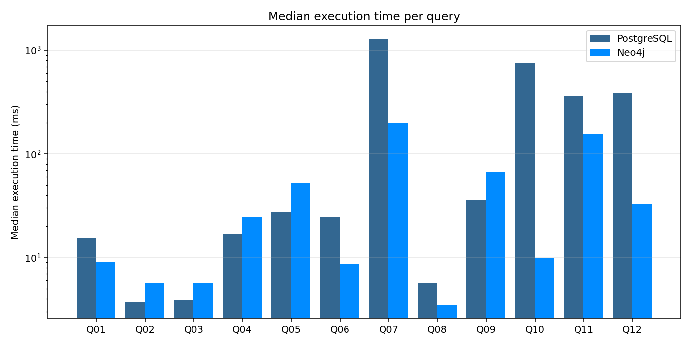
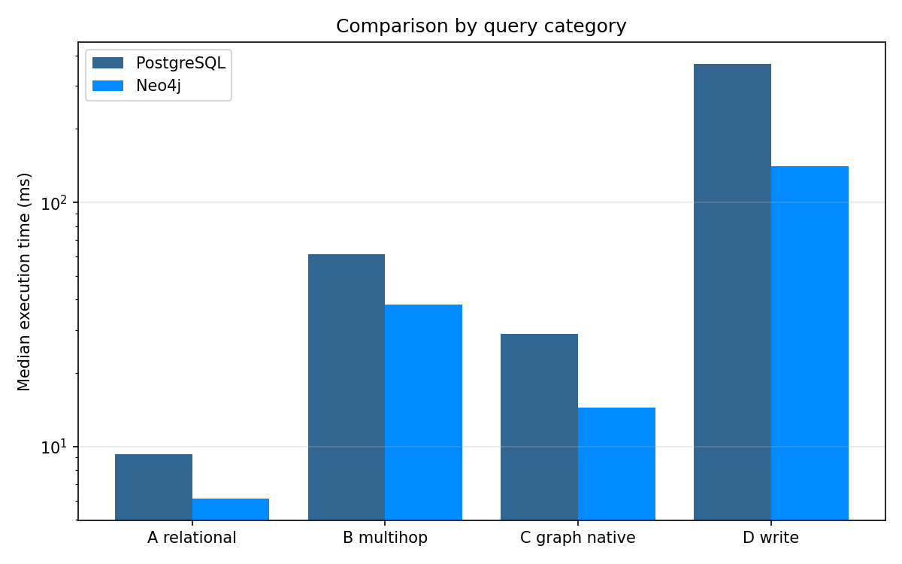
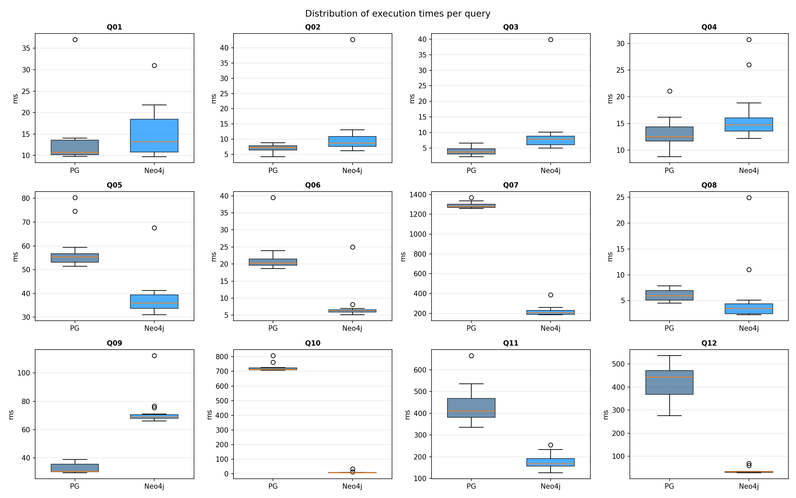
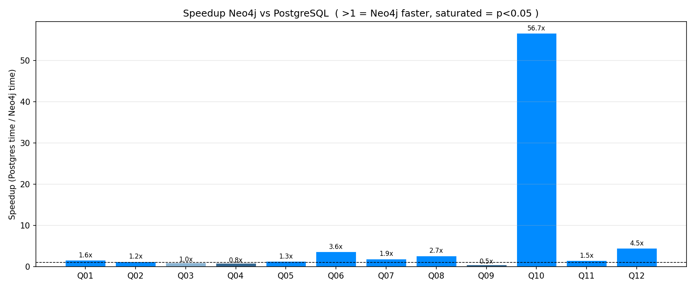
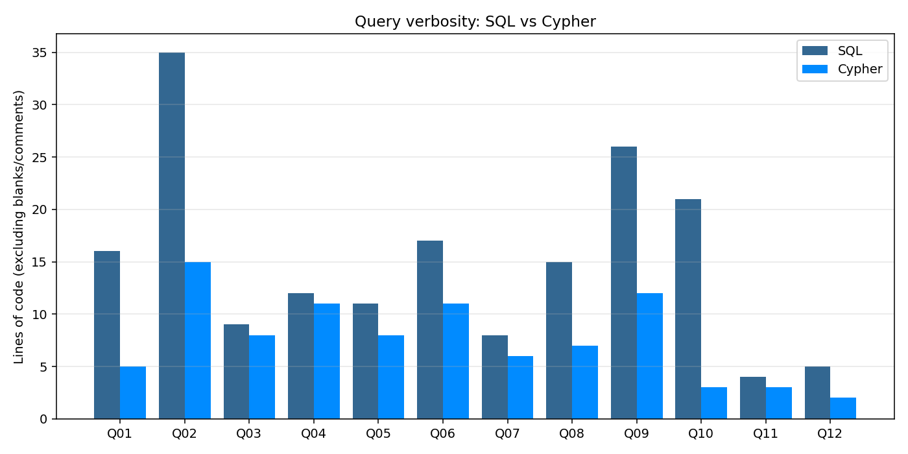
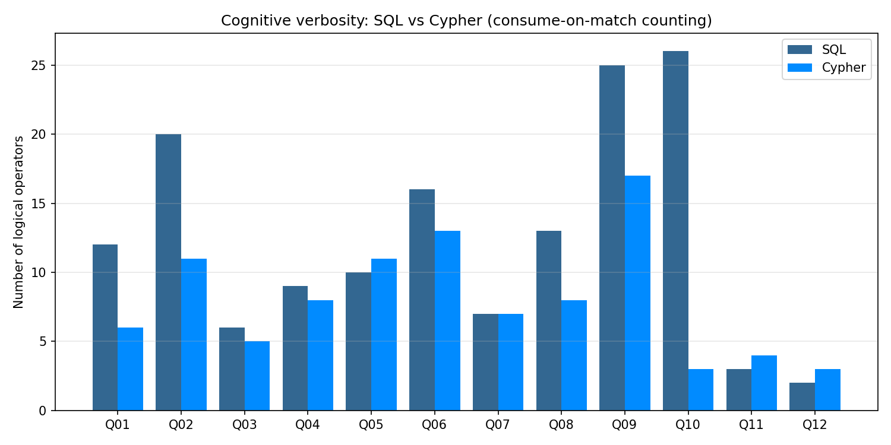

# Benchmark SQL vs Cypher — Report

Run: `run_20260524_230038`


## 1. Experimental setup

| Item | Value |
|---|---|
| Host | `192.168.1.52` |
| Platform | `macOS-26.5-arm64-arm-64bit` |
| CPU | `Apple M2` (8 cores) |
| Memory | 8.0 GB |
| Python | `3.12.3` |
| PostgreSQL | `PostgreSQL 18.3 (Homebrew) on aarch64-apple-darwin25.2.0, compiled by Apple clang version 17.0.0 (clang-1700.6.3.2), 64-bit` |
| Neo4j | `Neo4j Kernel 2026.04.0 (enterprise)` |
| Misure per query | 15 run + 1 warm-up scartato |
| Numero query | 12 |
| Test statistico | Mann-Whitney U (two-sided, alpha=0.05) |
| Intervalli di confidenza | Bootstrap 95% CI of the median (10000 resamples) |


### Configurazione runtime dei DBMS

**PostgreSQL**:

| Parameter | Value |
|---|---|
| `shared_buffers` | `128MB` |
| `work_mem` | `4MB` |
| `maintenance_work_mem` | `64MB` |
| `effective_cache_size` | `4GB` |
| `random_page_cost` | `4` |
| `seq_page_cost` | `1` |
| `max_parallel_workers_per_gather` | `2` |
| `jit` | `on` |
| `enable_hashjoin` | `on` |
| `enable_mergejoin` | `on` |
| `enable_nestloop` | `on` |
| `enable_seqscan` | `on` |
| `enable_indexscan` | `on` |

**Neo4j**:

| Parameter | Value |
|---|---|
| `server.memory.heap.initial_size` | `512.00MiB` |
| `server.memory.heap.max_size` | `1.00GiB` |
| `server.memory.pagecache.size` | `512.00MiB` |
| `db.tx_log.rotation.retention_policy` | `2 days 2G` |


## 2. Risultati

| ID | Query | Categoria | PG (ms) | Neo4j (ms) | CI 95% PG | CI 95% Neo4j | Vincitore | Speedup | p-value | Effect r | Sig | Risultati |
|---|---|---|---:|---:| :---: | :---: |---|---:|---:|---:|:---:|:---:|
| Q01 | Top scorers by season | A_relational | 10.8 | 13.2 | [10.219, 13.442] | [10.318, 18.525] | Postgres (ns) | 1.23x | 0.299758 | 0.2267 | No | OK |
| Q02 | League standings by season | A_relational | 7.4 | 8.8 | [6.236, 7.816] | [7.534, 11.648] | **Postgres** | 1.19x | 0.008972 | 0.5644 | Yes | OK |
| Q03 | Goals per match by league | A_relational | 3.8 | 7.9 | [2.923, 4.796] | [5.61, 8.885] | **Postgres** | 2.11x | 1.6e-05 | 0.9289 | Yes | OK |
| Q04 | Home win percentage by team | A_relational | 12.5 | 14.7 | [11.61, 15.097] | [13.74, 16.389] | **Postgres** | 1.18x | 0.01614 | 0.52 | Yes | OK |
| Q05 | Goal-assist partnerships | B_multihop | 55.4 | 36.0 | [52.611, 57.297] | [33.559, 40.502] | **Neo4j** | 1.54x | 4e-05 | 0.8844 | Yes | OK |
| Q06 | Cards received vs Real Madrid | B_multihop | 20.2 | 6.3 | [19.609, 21.446] | [5.951, 6.617] | **Neo4j** | 3.24x | 4.8e-05 | 0.8756 | Yes | OK |
| Q07 | Players in all 8 seasons | B_multihop | 1277.1 | 204.9 | [1269.257, 1301.474] | [187.61, 234.982] | **Neo4j** | 6.23x | 3e-06 | 1.0 | Yes | OK |
| Q08 | Teammates of Messi 2015/16 | C_graph_native | 5.9 | 3.5 | [4.9, 6.884] | [2.53, 3.93] | **Neo4j** | 1.69x | 0.001865 | 0.6711 | Yes | OK |
| Q09 | 2-hop teammates of Messi | C_graph_native | 30.6 | 68.8 | [30.059, 36.035] | [67.603, 71.081] | **Postgres** | 2.25x | 3e-06 | 1.0 | Yes | OK |
| Q10 | Shortest path Messi -> Pirlo | C_graph_native | 711.7 | 8.0 | [709.689, 726.346] | [7.422, 8.852] | **Neo4j** | 89.31x | 3e-06 | 1.0 | Yes | OK |
| Q11 | Bulk UPDATE on event subtype | D_write | 411.2 | 168.2 | [381.681, 442.496] | [155.519, 202.961] | **Neo4j** | 2.44x | 3e-06 | 1.0 | Yes | OK |
| Q12 | Schema evolution: add totalGoals | D_write | 443.4 | 32.4 | [356.919, 474.166] | [30.578, 34.134] | **Neo4j** | 13.70x | 3e-06 | 1.0 | Yes | OK |

Legenda: **grassetto** = differenza statisticamente significativa (p < 0.05, Mann-Whitney U); (ns) = non significativa. **Effect r** = correlazione rank-biserial (0 = distribuzioni indistinguibili, 1 = separazione completa): misura la *magnitudine* della differenza, complementare al p-value che ne misura l'affidabilita'.


11 confronti su 12 sono statisticamente significativi; 8 hanno effect size molto grande (r >= 0.8).


## 3. Tempi di esecuzione

Error bars rappresentano il 95% CI bootstrap della mediana. L'asterisco (*) indica significativita' statistica.




### Per categoria




## 4. Distribuzioni dei tempi

Box plot delle singole esecuzioni per query. Permette di valutare la dispersione e identificare outlier.




## 5. Speedup Neo4j vs Postgres

Valori > 1 indicano che Neo4j e' piu' veloce. Barre saturate: p < 0.05; barre desaturate: non significativo.




## 6. Espressivita': LOC e cognitive verbosity

**LOC** = righe non vuote e non di commento. **Cognitive verbosity** = numero di occorrenze di operatori logici distinti, con *consume-on-match*: le keyword composte (LEFT JOIN, NOT EXISTS, OPTIONAL MATCH, ORDER BY) vengono riconosciute per prime e rimosse dal testo prima di contare le keyword semplici, prevenendo il double-counting.






| ID | LOC SQL | LOC Cypher | LOC ratio | Verb SQL | Verb Cypher | Verb ratio |
|---|---:|---:|---:|---:|---:|---:|
| Q01 | 16 | 5 | 3.20x | 12 | 6 | 2.00x |
| Q02 | 35 | 15 | 2.33x | 20 | 11 | 1.82x |
| Q03 | 9 | 8 | 1.12x | 6 | 5 | 1.20x |
| Q04 | 12 | 11 | 1.09x | 9 | 8 | 1.12x |
| Q05 | 11 | 8 | 1.38x | 10 | 11 | 0.91x |
| Q06 | 17 | 11 | 1.55x | 16 | 13 | 1.23x |
| Q07 | 8 | 6 | 1.33x | 7 | 7 | 1.00x |
| Q08 | 15 | 7 | 2.14x | 13 | 8 | 1.62x |
| Q09 | 26 | 12 | 2.17x | 25 | 17 | 1.47x |
| Q10 | 21 | 3 | 7.00x | 26 | 3 | 8.67x |
| Q11 | 4 | 3 | 1.33x | 3 | 4 | 0.75x |
| Q12 | 5 | 2 | 2.50x | 2 | 3 | 0.67x |

### Nota metodologica sulla verbosity

La metrica cattura il numero di *step logici* che il lettore deve tracciare mentalmente. SQL e Cypher esprimono lo stesso concetto con meccanismi diversi: un pattern Cypher multi-nodo (es. `(a)-[:R]->(b)<-[:R]-(c)`) sussume cio' che in SQL richiede piu' JOIN espliciti. Questa asimmetria e' intrinseca ai linguaggi, non un artefatto della misurazione — la metrica la cattura intenzionalmente.


## 7. Analisi dei query plan

Per ogni query, il benchmark cattura `EXPLAIN (ANALYZE, BUFFERS)` per Postgres e `PROFILE` per Neo4j. Di seguito i plan piu' significativi.


### Q05: Goal-assist partnerships

**PostgreSQL** (`EXPLAIN ANALYZE`):

```
Sort  (cost=10592.31..10600.03 rows=3090 width=36) (actual time=54.163..54.165 rows=29.00 loops=1)
  Sort Key: (count(*)) DESC, scorer.player_name, assister.player_name
  Sort Method: quicksort  Memory: 26kB
  Buffers: shared hit=148266
  ->  HashAggregate  (cost=10297.33..10413.19 rows=3090 width=36) (actual time=53.414..54.144 rows=29.00 loops=1)
        Group Key: scorer.player_name, assister.player_name
        Filter: (count(*) >= 10)
        Batches: 1  Memory Usage: 1305kB
        Rows Removed by Filter: 12240
        Buffers: shared hit=148266
        ->  Merge Join  (cost=1.14..10227.81 rows=9269 width=28) (actual time=0.032..50.336 rows=16934.00 loops=1)
              Merge Cond: (e.player2_id = assister.player_api_id)
              Buffers: shared hit=148266
              ->  Nested Loop  (cost=0.72..42110.55 rows=9269 width=18) (actual time=0.027..46.791 rows=16934.00 loops=1)
                    Buffers: shared hit=137366
                    ->  Index Scan using ix_event_player2 on match_event e  (cost=0.42..40500.36 rows=9269 width=8) (actual time=0.021..40.486 rows=17000.00 loops=1)
                          Index Cond: (player2_id IS NOT NULL)
                          Filter: ((event_type)::text = 'goal'::text)
                          Rows Removed by Filter: 189945
                          Index Searches: 1
                          Buffers: shared hit=128603
                    ->  Memoize  (cost=0.30..0.37 rows=1 width=18) (actual time=0.000..0.000 rows=1.00 loops=17000)
                          Cache Key: e.player1_id
                          Cache Mode: logical
                          Hits: 14078  Misses: 2922  Evictions: 0  Overflows: 0  Memory Usage: 343kB
                          Buffers: shared hit=8763
                          ->  Index Scan using player_pkey on player scorer  (cost=0.29..0.36 rows=1 width=18) (actual time=0.001..0.001 rows=1.00 loops=2922)
                                Index Cond: (player_api_id = e.player1_id)
                                Index Searches: 2921
                                Buffers: shared hit=8763
              ->  Index Scan using player_pkey on player assister  (cost=0.29..710.16 rows=11060 width=18) (actual time=0.003..2.008 rows=11045.00 loops=1)
                    Index Searches: 1
                    Buffers: shared hit=10900
Planning:
  Buffers: shared hit=28
Planning Time: 0.193 ms
Execution Time: 54.192 ms
```

**Neo4j** (`PROFILE`):

```
+-- ProduceResults@neo4j  (rows: 29, dbHits: 0)
    identifiers: ['scorer', 'assister', 'partnerships']
  +-- Sort@neo4j  (rows: 29, dbHits: 0)
      identifiers: ['scorer', 'assister', 'partnerships']
    +-- Filter@neo4j  (rows: 29, dbHits: 0)
        identifiers: ['scorer', 'assister', 'partnerships']
      +-- EagerAggregation@neo4j  (rows: 12269, dbHits: 50802)
          identifiers: ['scorer', 'assister', 'partnerships']
        +-- Filter@neo4j  (rows: 16934, dbHits: 99860)
            identifiers: ['assister', 'a', 'm', 'g', 'scorer']
          +-- Expand(All)@neo4j  (rows: 65992, dbHits: 82992)
              identifiers: ['assister', 'a', 'm', 'g', 'scorer']
            +-- CacheProperties@neo4j  (rows: 17000, dbHits: 17014)
                identifiers: ['assister', 'a', 'm']
              +-- Filter@neo4j  (rows: 17000, dbHits: 34028)
                  identifiers: ['assister', 'a', 'm']
                +-- Expand(All)@neo4j  (rows: 17000, dbHits: 17000)
                    identifiers: ['assister', 'a', 'm']
                  +-- NodeByLabelScan@neo4j  (rows: 11060, dbHits: 11061)
                      identifiers: ['assister']
```


### Q07: Players in all 8 seasons

**PostgreSQL** (`EXPLAIN ANALYZE`):

```
GroupAggregate  (cost=75627.63..79830.34 rows=54 width=22) (actual time=1180.293..1336.631 rows=550.00 loops=1)
  Group Key: p.player_name
  Filter: (count(DISTINCT m.season) = 8)
  Rows Removed by Filter: 10298
  Buffers: shared hit=3752, temp read=2299 written=2308
  ->  Sort  (cost=75627.63..76983.33 rows=542281 width=24) (actual time=1180.154..1290.772 rows=542281.00 loops=1)
        Sort Key: p.player_name, m.season
        Sort Method: external merge  Disk: 18392kB
        Buffers: shared hit=3752, temp read=2299 written=2308
        ->  Hash Join  (cost=1145.38..12855.94 rows=542281 width=24) (actual time=13.612..164.813 rows=542281.00 loops=1)
              Hash Cond: (l.player_api_id = p.player_api_id)
              Buffers: shared hit=3752
              ->  Hash Join  (cost=801.53..11088.06 rows=542281 width=14) (actual time=8.654..96.371 rows=542281.00 loops=1)
                    Hash Cond: (l.match_api_id = m.match_api_id)
                    Buffers: shared hit=3657
                    ->  Seq Scan on match_lineup l  (cost=0.00..8862.81 rows=542281 width=8) (actual time=0.013..15.466 rows=542281.00 loops=1)
                          Buffers: shared hit=3440
                    ->  Hash  (cost=476.79..476.79 rows=25979 width=14) (actual time=8.616..8.617 rows=25979.00 loops=1)
                          Buckets: 32768  Batches: 1  Memory Usage: 1474kB
                          Buffers: shared hit=217
                          ->  Seq Scan on match m  (cost=0.00..476.79 rows=25979 width=14) (actual time=0.008..3.709 rows=25979.00 loops=1)
                                Buffers: shared hit=217
              ->  Hash  (cost=205.60..205.60 rows=11060 width=18) (actual time=4.920..4.920 rows=11060.00 loops=1)
                    Buckets: 16384  Batches: 1  Memory Usage: 691kB
                    Buffers: shared hit=95
                    ->  Seq Scan on player p  (cost=0.00..205.60 rows=11060 width=18) (actual time=0.014..1.991 rows=11060.00 loops=1)
                          Buffers: shared hit=95
Planning:
  Buffers: shared hit=28
Planning Time: 0.720 ms
Execution Time: 1339.171 ms
```

**Neo4j** (`PROFILE`):

```
+-- ProduceResults@neo4j  (rows: 550, dbHits: 0)
    identifiers: ['player_name', 'seasons_played', 'player']
  +-- Sort@neo4j  (rows: 550, dbHits: 0)
      identifiers: ['player_name', 'seasons_played', 'player']
    +-- Projection@neo4j  (rows: 550, dbHits: 0)
        identifiers: ['player_name', 'seasons_played', 'player']
      +-- Filter@neo4j  (rows: 550, dbHits: 0)
          identifiers: ['player_name', 'seasons_played']
        +-- EagerAggregation@neo4j  (rows: 10848, dbHits: 0)
            identifiers: ['player_name', 'seasons_played']
          +-- Projection@neo4j  (rows: 542281, dbHits: 1084562)
              identifiers: ['p', 'm', 'player_name', 'season']
            +-- Filter@neo4j  (rows: 542281, dbHits: 1084562)
                identifiers: ['p', 'm']
              +-- Expand(All)@neo4j  (rows: 542281, dbHits: 542281)
                  identifiers: ['p', 'm']
                +-- CacheProperties@neo4j  (rows: 11060, dbHits: 11584)
                    identifiers: ['p']
                  +-- NodeByLabelScan@neo4j  (rows: 11060, dbHits: 11061)
                      identifiers: ['p']
```


### Q09: 2-hop teammates of Messi

**PostgreSQL** (`EXPLAIN ANALYZE`):

```
Limit  (cost=1485.45..1485.50 rows=20 width=22) (actual time=29.674..29.677 rows=20.00 loops=1)
  Buffers: shared hit=10567
  CTE direct_teammates
    ->  HashAggregate  (cost=26.09..26.65 rows=56 width=4) (actual time=0.233..0.240 rows=57.00 loops=1)
          Group Key: pf_2.player_api_id
          Batches: 1  Memory Usage: 32kB
          Buffers: shared hit=207
          ->  Nested Loop  (cost=4.89..25.95 rows=56 width=4) (actual time=0.034..0.195 rows=183.00 loops=1)
                Buffers: shared hit=207
                ->  Nested Loop  (cost=4.60..23.64 rows=3 width=14) (actual time=0.025..0.033 rows=8.00 loops=1)
                      Buffers: shared hit=13
                      ->  Index Scan using ix_player_name on player p_1  (cost=0.29..8.30 rows=1 width=4) (actual time=0.013..0.013 rows=1.00 loops=1)
                            Index Cond: ((player_name)::text = 'Lionel Messi'::text)
                            Index Searches: 1
                            Buffers: shared hit=3
                      ->  Bitmap Heap Scan on mv_played_for pf_3  (cost=4.31..15.31 rows=3 width=18) (actual time=0.011..0.017 rows=8.00 loops=1)
                            Recheck Cond: (player_api_id = p_1.player_api_id)
                            Heap Blocks: exact=8
                            Buffers: shared hit=10
                            ->  Bitmap Index Scan on ix_mv_played_for_player  (cost=0.00..4.31 rows=3 width=0) (actual time=0.005..0.005 rows=8.00 loops=1)
                                  Index Cond: (player_api_id = p_1.player_api_id)
                                  Index Searches: 1
                                  Buffers: shared hit=2
                ->  Index Scan using ix_mv_played_for_team_season on mv_played_for pf_2  (cost=0.29..0.62 rows=15 width=18) (actual time=0.004..0.017 rows=22.88 loops=8)
                      Index Cond: ((team_api_id = pf_3.team_api_id) AND ((season)::text = (pf_3.season)::text))
                      Index Searches: 8
                      Buffers: shared hit=194
  ->  Sort  (cost=1458.80..1458.95 rows=59 width=22) (actual time=29.673..29.675 rows=20.00 loops=1)
        Sort Key: (count(*)) DESC, p.player_name
        Sort Method: top-N heapsort  Memory: 27kB
        Buffers: shared hit=10567
        ->  GroupAggregate  (cost=1456.20..1457.23 rows=59 width=22) (actual time=29.069..29.508 rows=1735.00 loops=1)
              Group Key: p.player_name
              Buffers: shared hit=10567
              ->  Sort  (cost=1456.20..1456.35 rows=59 width=14) (actual time=29.065..29.134 rows=3228.00 loops=1)
                    Sort Key: p.player_name
                    Sort Method: quicksort  Memory: 97kB
                    Buffers: shared hit=10567
                    ->  Nested Loop  (cost=682.52..1454.47 rows=59 width=14) (actual time=1.308..23.821 rows=3228.00 loops=1)
                          Buffers: shared hit=10567
                          ->  Hash Join  (cost=682.23..1434.64 rows=59 width=4) (actual time=1.297..16.825 rows=3228.00 loops=1)
                                Hash Cond: ((pf.team_api_id = pf_1.team_api_id) AND ((pf.season)::text = (pf_1.season)::text))
                                Buffers: shared hit=883
                                ->  Seq Scan on mv_played_for pf  (cost=1.26..661.79 rows=17501 width=18) (actual time=0.273..9.393 rows=34656.00 loops=1)
                                      Filter: (NOT (ANY (player_api_id = (hashed SubPlan 2).col1)))
                                      Rows Removed by Filter: 346
                                      Buffers: shared hit=430
                                      SubPlan 2
                                        ->  CTE Scan on direct_teammates  (cost=0.00..1.12 rows=56 width=4) (actual time=0.234..0.252 rows=57.00 loops=1)
                                              Storage: Memory  Maximum Storage: 18kB
                                              Buffers: shared hit=207
                                ->  Hash  (cost=678.23..678.23 rows=183 width=14) (actual time=0.998..0.999 rows=146.00 loops=1)
                                      Buckets: 1024  Batches: 1  Memory Usage: 15kB
                                      Buffers: shared hit=453
                                      ->  Unique  (cost=676.85..678.23 rows=183 width=14) (actual time=0.777..0.946 rows=146.00 loops=1)
                                            Buffers: shared hit=453
                                            ->  Sort  (cost=676.85..677.31 rows=183 width=14) (actual time=0.776..0.822 rows=346.00 loops=1)
                                                  Sort Key: pf_1.team_api_id, pf_1.season
                                                  Sort Method: quicksort  Memory: 35kB
                                                  Buffers: shared hit=453
                                                  ->  Nested Loop  (cost=0.29..669.98 rows=183 width=14) (actual time=0.005..0.296 rows=346.00 loops=1)
                                                        Buffers: shared hit=453
                                                        ->  CTE Scan on direct_teammates d  (cost=0.00..1.12 rows=56 width=4) (actual time=0.000..0.005 rows=57.00 loops=1)
                                                              Storage: Memory  Maximum Storage: 18kB
                                                        ->  Index Scan using ix_mv_played_for_player on mv_played_for pf_1  (cost=0.29..11.91 rows=3 width=18) (actual time=0.002..0.004 rows=6.07 loops=57)
                                                              Index Cond: (player_api_id = d.player_api_id)
                                                              Index Searches: 57
                                                              Buffers: shared hit=453
                          ->  Index Scan using player_pkey on player p  (cost=0.29..0.34 rows=1 width=18) (actual time=0.002..0.002 rows=1.00 loops=3228)
                                Index Cond: (player_api_id = pf.player_api_id)
                                Filter: ((player_name)::text <> 'Lionel Messi'::text)
                                Index Searches: 3228
                                Buffers: shared hit=9684
Planning:
  Buffers: shared hit=36
Planning Time: 0.868 ms
Execution Time: 29.736 ms
```

**Neo4j** (`PROFILE`):

```
+-- ProduceResults@neo4j  (rows: 20, dbHits: 0)
    identifiers: ['player_2hop', 'connection_strength']
  +-- Top@neo4j  (rows: 20, dbHits: 0)
      identifiers: ['player_2hop', 'connection_strength']
    +-- EagerAggregation@neo4j  (rows: 1735, dbHits: 0)
        identifiers: ['player_2hop', 'connection_strength']
      +-- Filter@neo4j  (rows: 3228, dbHits: 110424)
          identifiers: ['x', 't3', 'r4', 'p2', 'direct_set', 'covered_pairs']
        +-- Expand(All)@neo4j  (rows: 34656, dbHits: 34656)
            identifiers: ['x', 't3', 'r4', 'p2', 'direct_set', 'covered_pairs']
          +-- CacheProperties@neo4j  (rows: 11003, dbHits: 11005)
              identifiers: ['x', 'direct_set', 'covered_pairs', 'p2']
            +-- Filter@neo4j  (rows: 11003, dbHits: 0)
                identifiers: ['x', 'direct_set', 'covered_pairs', 'p2']
              +-- Apply@neo4j  (rows: 11060, dbHits: 0)
                  identifiers: ['x', 'direct_set', 'covered_pairs', 'p2']
                +-- EagerAggregation@neo4j  (rows: 1, dbHits: 338)
                    identifiers: ['x', 'direct_set', 'covered_pairs']
                  +-- Filter@neo4j  (rows: 338, dbHits: 676)
                      identifiers: ['x', 't2', 'direct_set', 'r3', 'd']
                    +-- Expand(All)@neo4j  (rows: 35002, dbHits: 35002)
                        identifiers: ['x', 't2', 'direct_set', 'r3', 'd']
                      +-- CacheProperties@neo4j  (rows: 299, dbHits: 299)
                          identifiers: ['x', 'direct_set', 't2']
                        +-- Apply@neo4j  (rows: 299, dbHits: 0)
                            identifiers: ['x', 'direct_set', 't2']
                          +-- EagerAggregation@neo4j  (rows: 1, dbHits: 0)
                              identifiers: ['x', 'direct_set']
                            +-- Filter@neo4j  (rows: 175, dbHits: 1806)
                                identifiers: ['x', 't', 'direct', 'r1', 'r2']
                              +-- Expand(All)@neo4j  (rows: 1464, dbHits: 1472)
                                  identifiers: ['x', 't', 'direct', 'r1', 'r2']
                                +-- CacheProperties@neo4j  (rows: 8, dbHits: 8)
                                    identifiers: ['x', 'r1', 't']
                                  +-- Filter@neo4j  (rows: 8, dbHits: 16)
                                      identifiers: ['x', 'r1', 't']
                                    +-- Expand(All)@neo4j  (rows: 8, dbHits: 8)
                                        identifiers: ['x', 'r1', 't']
                                      +-- NodeIndexSeek@neo4j  (rows: 1, dbHits: 2)
                                          identifiers: ['x']
                          +-- NodeByLabelScan@neo4j  (rows: 299, dbHits: 300)
                              identifiers: ['x', 'direct_set', 't2']
                +-- NodeByLabelScan@neo4j  (rows: 11060, dbHits: 11061)
                    identifiers: ['x', 'direct_set', 'covered_pairs', 'p2']
```


### Q10: Shortest path Messi -> Pirlo

**PostgreSQL** (`EXPLAIN ANALYZE`):

```
Aggregate  (cost=621.74..621.75 rows=1 width=4) (actual time=859.902..859.904 rows=1.00 loops=1)
  Buffers: shared hit=2977128
  CTE endpoints
    ->  Result  (cost=16.61..16.62 rows=1 width=8) (actual time=0.009..0.009 rows=1.00 loops=1)
          Buffers: shared hit=6
          InitPlan 1
            ->  Limit  (cost=0.29..8.30 rows=1 width=4) (actual time=0.005..0.005 rows=1.00 loops=1)
                  Buffers: shared hit=3
                  ->  Index Scan using ix_player_name on player  (cost=0.29..8.30 rows=1 width=4) (actual time=0.004..0.004 rows=1.00 loops=1)
                        Index Cond: ((player_name)::text = 'Lionel Messi'::text)
                        Index Searches: 1
                        Buffers: shared hit=3
          InitPlan 2
            ->  Limit  (cost=0.29..8.30 rows=1 width=4) (actual time=0.004..0.004 rows=1.00 loops=1)
                  Buffers: shared hit=3
                  ->  Index Scan using ix_player_name on player player_1  (cost=0.29..8.30 rows=1 width=4) (actual time=0.003..0.004 rows=1.00 loops=1)
                        Index Cond: ((player_name)::text = 'Andrea Pirlo'::text)
                        Index Searches: 1
                        Buffers: shared hit=3
  CTE bfs
    ->  Recursive Union  (cost=0.00..565.23 rows=1771 width=8) (actual time=0.009..855.802 rows=44251.00 loops=1)
          Storage: Memory  Maximum Storage: 948kB
          Buffers: shared hit=2977128
          ->  CTE Scan on endpoints  (cost=0.00..0.02 rows=1 width=8) (actual time=0.009..0.009 rows=1.00 loops=1)
                Storage: Memory  Maximum Storage: 17kB
                Buffers: shared hit=6
          ->  Nested Loop  (cost=4.60..54.75 rows=177 width=8) (actual time=0.038..93.285 rows=371901.29 loops=7)
                Join Filter: (pf2.player_api_id <> b.player_api_id)
                Rows Removed by Join Filter: 15840
                Buffers: shared hit=2977122
                ->  Nested Loop  (cost=4.31..46.24 rows=10 width=22) (actual time=0.037..11.323 rows=15839.86 loops=7)
                      Buffers: shared hit=176237
                      ->  WorkTable Scan on bfs b  (cost=0.00..0.22 rows=3 width=8) (actual time=0.035..0.612 rows=4741.57 loops=7)
                            Filter: (distance < 6)
                            Rows Removed by Filter: 1580
                      ->  Bitmap Heap Scan on mv_played_for pf1  (cost=4.31..15.31 rows=3 width=18) (actual time=0.001..0.002 rows=3.34 loops=33191)
                            Recheck Cond: (player_api_id = b.player_api_id)
                            Heap Blocks: exact=109855
                            Buffers: shared hit=176237
                            ->  Bitmap Index Scan on ix_mv_played_for_player  (cost=0.00..4.31 rows=3 width=0) (actual time=0.001..0.001 rows=3.34 loops=33191)
                                  Index Cond: (player_api_id = b.player_api_id)
                                  Index Searches: 33191
                                  Buffers: shared hit=66382
                ->  Index Scan using ix_mv_played_for_team_season on mv_played_for pf2  (cost=0.29..0.62 rows=15 width=18) (actual time=0.001..0.004 rows=24.48 loops=110879)
                      Index Cond: ((team_api_id = pf1.team_api_id) AND ((season)::text = (pf1.season)::text))
                      Index Searches: 110879
                      Buffers: shared hit=2800885
  InitPlan 5
    ->  CTE Scan on endpoints endpoints_1  (cost=0.00..0.02 rows=1 width=4) (actual time=0.000..0.000 rows=1.00 loops=1)
          Storage: Memory  Maximum Storage: 17kB
  ->  CTE Scan on bfs  (cost=0.00..39.85 rows=9 width=4) (actual time=1.147..859.901 rows=5.00 loops=1)
        Filter: (player_api_id = (InitPlan 5).col1)
        Rows Removed by Filter: 44246
        Storage: Memory  Maximum Storage: 1895kB
        Buffers: shared hit=2977128
Planning:
  Buffers: shared hit=12
Planning Time: 0.192 ms
Execution Time: 859.922 ms
```

**Neo4j** (`PROFILE`):

```
+-- ProduceResults@neo4j  (rows: 1, dbHits: 0)
    identifiers: ['path', 'a', 'shortest_path_hops', 'anon_0', 'b']
  +-- Projection@neo4j  (rows: 1, dbHits: 0)
      identifiers: ['path', 'a', 'shortest_path_hops', 'anon_0', 'b']
    +-- ShortestPath@neo4j  (rows: 1, dbHits: 237)
        identifiers: ['a', 'b', 'path', 'anon_0']
      +-- MultiNodeIndexSeek@neo4j  (rows: 0, dbHits: 0)
          identifiers: ['a', 'b']
```


I plan completi per tutte le 12 query sono in `benchmark/results/run_20260524_230038/plans/`.


## 8. Verifica di correttezza

Tutte le 10 query read (Q01-Q10) restituiscono risultati semanticamente equivalenti nei due sistemi, verificato come confronto di insiemi di tuple normalizzate (arrotondamento a 4 decimali, date come ISO-8601, ordine irrilevante). Le 2 query write (Q11-Q12) producono conteggi identici di righe modificate.


## 9. Index ablation

Matrice di ablazione: per ciascuna coppia (indice, query), il benchmark rimuove l'indice, riesegue la query, e lo ripristina. Lo slowdown misura il rapporto tra la mediana senza indice e la mediana con indice.

| System | Index | Query | With (ms) | Without (ms) | Slowdown |
|---|---|---|---:|---:|---:|
| postgres | `ix_lineup_player` | Q08 | 3.2 | 11.2 | **3.48x** |
| postgres | `ix_mv_played_for_player` | Q09 | 11.9 | 14.0 | 1.18x |
| postgres | `ix_mv_played_for_player` | Q10 | 718.7 | 734.4 | 1.02x |
| postgres | `ix_event_player1` | Q05 | 58.9 | 64.9 | 1.10x |
| neo4j | `player_name_idx` | Q08 | 3.9 | 7.4 | **1.91x** |
| neo4j | `match_season_idx` | Q03 | 8.5 | 13.9 | **1.64x** |
| neo4j | `team_name_idx` | Q06 | 6.2 | 3.8 | 0.62x |


## 10. Analisi di sensibilita': work_mem e lo spill di Q07

Il piano di Q07 contiene l'unico accesso a disco dell'intero benchmark: un sort *external merge* (~18 MB di file temporanei) causato dal `work_mem` di default (4MB). Ipotesi da verificare: quanto del gap Postgres/Neo4j su Q07 e' un artefatto di questo parametro di tuning?

Q07 e' stata rieseguita solo su Postgres (15 run + warm-up per configurazione, `SET work_mem` a livello di sessione):

| work_mem | Mediana PG (ms) | CI 95% | Sort method (EXPLAIN ANALYZE) | Gap vs Neo4j |
|---|---:|:---:|---|---:|
| 4MB | 1211.1 | [1206.5, 1231.8] | `external merge  Disk: 18392kB` | 5.91x |
| 64MB | 1209.4 | [1208.7, 1211.7] | `quicksort  Memory: 46429kB` | 5.90x |

**Risultato: ipotesi smentita.** Eliminare lo spill (il sort passa a quicksort interamente in memoria) sposta la mediana dello 0.1%. Su macOS i file temporanei restano nella page cache del sistema operativo, quindi l'external merge non paga I/O fisico. Il collo di bottiglia reale e' la strategia sort-based scelta dal planner per `COUNT(DISTINCT)` su 542k righe, non il disco: il gap con Neo4j (hash aggregation sulle relazioni) **non e' un artefatto di tuning**.


## 11. Ease-of-use e suitability

La terza dimensione dichiarata nella proposal e' l'ease-of-use dei due sistemi. E' per natura la meno misurabile: per non ridurla a un'opinione, la ancoriamo a **proxy oggettivi prodotti dal progetto stesso** (righe di codice della pipeline, dipendenze, statement DDL) e ai problemi **effettivamente incontrati** e documentati in `reports/engineering_challenges.md` e nella storia del repository.

| Aspetto | PostgreSQL | Neo4j |
|---|---|---|
| Definizione dello schema | 9 `CREATE TABLE` + 19 indici; tipi, PK composite, FK e `CHECK` espliciti | 7 constraint di unicita' + 4 indici; lo schema e' *implicito*, emerge dal load |
| Bulk load (~1.5M righe) | `COPY FROM STDIN`: 1 statement per tabella, nessuna dipendenza esterna | `LOAD CSV`; per le 542k `LINEUP_OF` serve `apoc.periodic.iterate` (batch 5000) — cioe' il **plugin APOC** — o una transazione monolitica |
| Codice di load (LOC) | 150 (`load_postgres.py`) | 240 (`load_neo4j.py`, +60%) |
| Relazione derivata player-team-season | `CREATE MATERIALIZED VIEW` + `REFRESH` | `MATCH ... MERGE` di aggregazione post-load |
| Integrita' referenziale | **Enforced**: il `COPY` di `match_event` e' *fallito* per FK violation, rivelando 5.632 riferimenti orfani (Challenge 1) | Non esiste FK: un `MATCH` su un `Player` mancante non lega la riga e la **scarta in silenzio** — lo stesso difetto sarebbe passato inosservato |
| Strumenti di analisi delle performance | `EXPLAIN (ANALYZE, BUFFERS)`: piano testuale con costi stimati/reali, buffer, tempi per nodo | `PROFILE`: albero di operatori con rows e db hits, visualizzato nel Browser |
| Ambiente interattivo | `psql` / pgAdmin | Neo4j Browser, con visualizzazione nativa del grafo |
| Curva di apprendimento | SQL: prerequisito del corso | Cypher: nuovo per entrambi gli autori; i pattern ASCII-art (`(a)-[:R]->(b)`) sono intuitivi per i traversal, meno per le aggregazioni (Q02, classifica: l'`UNION ALL` SQL diventa un `UNWIND` su una lista di mappe) |
| Pitfall incontrati | Tipizzazione rigida: colonne pandas integer-con-NaN rifiutate (Challenge 2) | Semantica di `NULL` (`NULL = NULL` e' null: Q05 richiedeva un `IS NOT NULL` esplicito per equivalere al self-join SQL); direzionalita' di `PLAYED_FOR` (6 hop = `*..12` archi); `shortestPath` non esprime predicati fra archi consecutivi |

Tre osservazioni:

1. **Lo schema esplicito e' un costo iniziale che si ripaga come rete di sicurezza.** Le 273 righe di DDL di Postgres sono sembrate overhead finche' il vincolo FK ha intercettato un difetto reale del dataset che il modello a grafo avrebbe assorbito silenziosamente. In un progetto data-intensive, *fallire presto* e' una feature.

2. **Scrivere query e' piu' facile in Cypher, caricare dati e' piu' facile in SQL.** Un pattern come `(:Team {name:'Milan'})<-[:PLAYED_FOR]-(p)-[:PLAYED_FOR]->(:Team {name:'Juventus'})` sostituisce quattro join; ma il bulk load ha richiesto +60% di codice e un plugin, e l'assenza di tipi sui property ha spostato la validazione sull'ETL.

3. **La semantica implicita di Cypher e' la fonte principale di errori sottili.** Tutti e tre i pitfall Cypher (NULL, direzionalita', predicati di path) sono emersi solo grazie alla verifica automatica di equivalenza dei risultati: senza un oracolo relazionale accanto, sarebbero rimasti invisibili. E' un argomento a favore di mantenere entrambi i sistemi durante lo sviluppo, anche quando la produzione ne usera' uno solo.

**Suitability per il dominio**: il dataset calcistico e' *misto*: le anagrafiche, le classifiche e le statistiche per stagione sono relazionali; le reti di compagni di squadra e le catene di trasferimenti sono grafi. Nessuno dei due modelli e' "naturale" per l'intero dominio, il che rende il caso di studio adatto a un confronto — e la persistenza poliglotta (sez. 13) la risposta pragmatica.


## 12. Considerazioni sulla scalabilita'

Il benchmark e' single-node e single-user (8 GB di RAM, working set interamente in cache: nessun piano contiene `shared read`). Non misura la scalabilita', ma i piani catturati permettono di **ragionare su come i costi crescono** con i dati, e l'architettura dei due sistemi su come si distribuiscono.

### Crescita dei dati su un singolo nodo

- **Aggregazioni full-scan (Q07)**: il piano Postgres ordina 542.281 righe (`external merge`, 18 MB); il costo e' O(n log n) nel numero di righe di formazione. A 10x (80 stagioni) lo spill crescerebbe in proporzione, ma il rimedio e' standard: partizionamento dichiarativo per `season` e `work_mem` dimensionato. Neo4j aggrega le stesse relazioni in modo lineare, ma **senza meccanismo di spill**: il grafo deve stare nella pagecache, altrimenti il degrado e' brusco.

- **Traversal a profondita' variabile (Q10)**: la CTE ricorsiva materializza l'intera frontiera BFS — 44.251 stati e 2.977.128 accessi al buffer per profondita' <= 6 — un costo che cresce con la dimensione del grafo *e* esponenzialmente con la profondita'. `shortestPath()` (BFS bidirezionale) tocca 237 db hits: il lavoro dipende dalla lunghezza del cammino e dal grado dei nodi attraversati, **non dalla dimensione totale del grafo**. E' l'index-free adjacency letta come proprieta' di scaling: il 89x osservato non e' un artefatto della taglia del dataset ma tende ad *allargarsi* al crescere dei dati.

- **Scritture (Q11/Q12)**: in Postgres ogni `UPDATE` crea nuove versioni di tupla (MVCC) da ripulire con `VACUUM`; in Neo4j la scrittura passa dal transaction log. Entrambi i sistemi sono stati misurati con un solo writer: sotto scrittori concorrenti entrano in gioco lock a livello di riga (Postgres) e di nodo/relazione (Neo4j), non testati.

### Scaling orizzontale

- **PostgreSQL**: la replica in streaming scala le *letture* senza toccare le query (l'intero benchmark read girerebbe invariato su una replica). Lo sharding dei *dati* (Citus) richiede una chiave di distribuzione; i join multi-hop di Q09/Q10 fra shard diversi diventano join di rete e degradano.

- **Neo4j**: il causal cluster replica l'**intero grafo** su ogni core member — scala le letture, non i dati. Il partizionamento reale (Fabric / composite database) e' manuale, e un traversal che attraversa una partizione perde l'index-free adjacency. E' il limite noto dei graph database: il partizionamento di un grafo minimizzando gli archi tagliati e' un problema NP-hard, e la proprieta' che rende Q10 89x piu' veloce su un nodo e' esattamente quella che **non si distribuisce gratis**.

### Verdetto

A 10x i dati (80 stagioni, ~5M formazioni, ~9M eventi) entrambi i sistemi restano su un nodo con accorgimenti ordinari (partizionamento e `work_mem` per Postgres, pagecache dimensionata per Neo4j) e i rapporti osservati si conservano o si accentuano a favore di Neo4j sui traversal. Oltre la memoria di una singola macchina, il workload OLAP scala meglio in Postgres (Citus, storage colonnare); il workload a grafo scala in Neo4j solo finche' il grafo e' replicabile per intero. La misura di questi regimi e' il lavoro futuro piu' rilevante (sez. 16).


## 13. Conclusioni

Sei risultati emersi dai dati:


1. **Postgres domina sulle aggregazioni OLAP-light** (categoria A): 3 query su 4 a favore di Postgres. L'ottimizzatore relazionale maturo e gli indici B-tree sono ideali per query con join limitati e aggregazioni semplici.


2. **Neo4j domina sul traversal a profondita' variabile** (Q10): **89.3x piu' veloce**. I piani catturati mostrano il perche': la CTE ricorsiva di Postgres materializza l'intera frontiera BFS (decine di migliaia di stati, milioni di accessi al buffer), mentre `shortestPath()` si ferma appena i due fronti si incontrano (poche centinaia di db hits). E' l'effetto dell'index-free adjacency.


3. **Neo4j vince anche sull'aggregazione full-scan** (Q07, 6.2x), ma per una ragione diversa dal traversal: il planner Postgres esegue `COUNT(DISTINCT)` con una strategia sort-based su 542k righe, mentre Neo4j aggrega le stesse relazioni con hash aggregation. L'analisi di sensibilita' (sez. 10) esclude che il gap dipenda dal tuning di `work_mem`.


4. **La materialized view equalizza il campo sulle query intermedie** (Q09): Postgres con `mv_played_for` vince su una query 2-hop che, senza la precomputazione, sarebbe dominata da Neo4j. Questo isola il contributo del *motore di esecuzione* da quello del *modello di carico*.


5. **Espressivita'**: Cypher e' sistematicamente piu' breve del SQL equivalente. Il caso estremo e' Q10: 3 LOC / 3 operatori logici in Cypher contro ~21 LOC / ~26 operatori in SQL (CTE ricorsiva BFS).


6. **Schema flexibility** (Q12): aggiungere un attributo derivato a tutti i match costa ~32 ms in Neo4j (singolo `SET`) vs ~443 ms in Postgres (`ALTER TABLE` + `UPDATE`). Rilevante in contesti con schema evolution frequente.


**Verdetto operativo**:

- **PostgreSQL**: aggregazioni OLAP, schema stabile e fortemente vincolato, integrita' referenziale critica, ecosistema BI/ETL maturo.

- **Neo4j**: dominio intrinsecamente a grafo, traversal a profondita' variabile (raccomandazione, fraud detection, supply chain), schema evolution frequente.

- **Polyglot persistence**: in produzione i due DB spesso coesistono, ciascuno gestendo la parte del dominio per cui e' nato. L'analisi di ease-of-use (sez. 11) aggiunge un argomento operativo: tenere il modello relazionale accanto a quello a grafo durante lo sviluppo intercetta errori di dati e di semantica che il grafo da solo assorbe in silenzio.


## 14. Threats to validity


### Validita' interna

- **Warm-up e caching**: la prima esecuzione di ogni query viene scartata per escludere cold-cache effects. Le esecuzioni successive beneficiano della page cache OS e della buffer pool dei DBMS. Il benchmark misura quindi performance *warm-cache*, coerente con un sistema in regime.

- **Variabilita' di misurazione**: le query con mediane < 20 ms e speedup < 1.3x (Q01, Q02, Q04) hanno CI parzialmente sovrapposti tra i due sistemi. Il test di Mann-Whitney identifica quali differenze sono statisticamente significative; per Q01 la differenza resta nel rumore di misurazione (p = 0.30).

- **Rollback nelle write query**: Q11 e Q12 usano rollback per mantenere lo stato pulito tra le run. Il costo del rollback e' escluso dal timer in entrambi i sistemi.


### Validita' esterna

- **Single-node, single-user**: il benchmark non misura performance sotto carico concorrente (write contention, MVCC vs lock-free traversal), carico OLTP intensivo, o scaling orizzontale.

- **Dimensione del dataset**: 26k match, 917k eventi, 542k lineup rows. Un dataset di dimensione *media*: abbastanza grande da rendere significative le differenze di query plan, ma non abbastanza per evidenziare problemi di scalabilita' I/O.

- **Configurazione di default e asimmetria di memoria**: entrambi i DBMS usano la configurazione di default (documentata nella sezione Setup), che assegna budget di memoria diversi: `shared_buffers` 128MB per Postgres contro heap 1GiB + pagecache 512MiB per Neo4j. Due evidenze empiriche ne limitano l'impatto: (i) nessuno dei 24 piani catturati contiene letture fisiche (`shared read`) — il working set e' interamente in cache in entrambi i sistemi; (ii) l'analisi di sensibilita' su `work_mem` (sez. 10) mostra che l'unico spill del benchmark non sposta la mediana. Un tuning sistematico resta comunque una variabile non esplorata per i confronti piu' tirati (categoria A).

- **Asimmetria nel caricamento**: Postgres carica `PlayerStats` e `TeamStats` (~184k righe) che Neo4j non importa. Su 8 GB di RAM l'impatto sulla cache e' trascurabile, ma va documentato.


### Validita' del costrutto

- **Cognitive verbosity**: la metrica cattura il numero di operatori logici, non la complessita' semantica. Un self-join e un FK join contano uguale. La metrica e' complementare (non sostitutiva) a LOC.

- **Tassonomia delle query**: la classificazione A/B/C/D e' definita *a priori* in base alla struttura logica, non *a posteriori* in base ai risultati. Questo previene il cherry-picking.


## 15. Note metodologiche

- I tempi riportati sono **mediani**; min, max, IQR e 95% CI sono in `summary.csv`.

- La significativita' statistica e' valutata con il test di **Mann-Whitney U** (non parametrico, two-sided, alpha = 0.05), con effect size **rank-biserial**. Gli intervalli di confidenza sono calcolati con **bootstrap** della mediana (10.000 ricampionamenti, seed fisso 42: i CI sono riproducibili bit-a-bit).

- I risultati nei due sistemi sono confrontati come *insiemi* di tuple, con normalizzazione di tipi (Decimal, date) e arrotondamento a 4 decimali.

- Per garantire un confronto **fair** su Q08/Q09/Q10, Postgres precomputa la materialized view `mv_played_for(player, team, season)`, equivalente alla relazione derivata `:PLAYED_FOR` di Neo4j.

- I query plan (`EXPLAIN ANALYZE` e `PROFILE`) sono catturati automaticamente dall'harness e salvati in `plans/`.


## 16. Limitations e lavoro futuro

Restano fuori dallo scope di questo lavoro:

- Carico **concorrente** (write contention, lock, MVCC vs lock-free traversal).

- Carico **OLTP intensivo** (insert rate, transazioni distribuite).

- Scaling **orizzontale** (sharding Postgres con Citus vs Neo4j Fabric): discusso qualitativamente in sez. 12, non misurato.

- Benchmark **standardizzati** su dataset grafo (LDBC Social Network Benchmark).

- **Tuning sistematico** dei sistemi: esplorato solo `work_mem` su Q07 (sez. 10); resta fuori un grid completo (shared_buffers, pagecache, parallelismo).


## 17. Riferimenti

- Angles, R., Gutierrez, C. (2008). *Survey of Graph Database Models*. ACM Computing Surveys, 40(1).

- Vicknair, C. et al. (2010). *A Comparison of a Graph Database and a Relational Database*. ACM SE 2010.

- Holzschuher, F., Peinl, R. (2013). *Performance of Graph Query Languages: Comparison of Cypher, Gremlin and Native Access in Neo4j*. EDBT/ICDT Workshops.

- Erling, O. et al. (2015). *The LDBC Social Network Benchmark: Interactive Workload*. SIGMOD 2015.

- Robinson, I., Webber, J., Eifrem, E. (2015). *Graph Databases* (2nd ed.). O'Reilly Media.

- Mann, H. B., Whitney, D. R. (1947). *On a Test of Whether one of Two Random Variables is Stochastically Larger than the Other*. Annals of Mathematical Statistics, 18(1).
