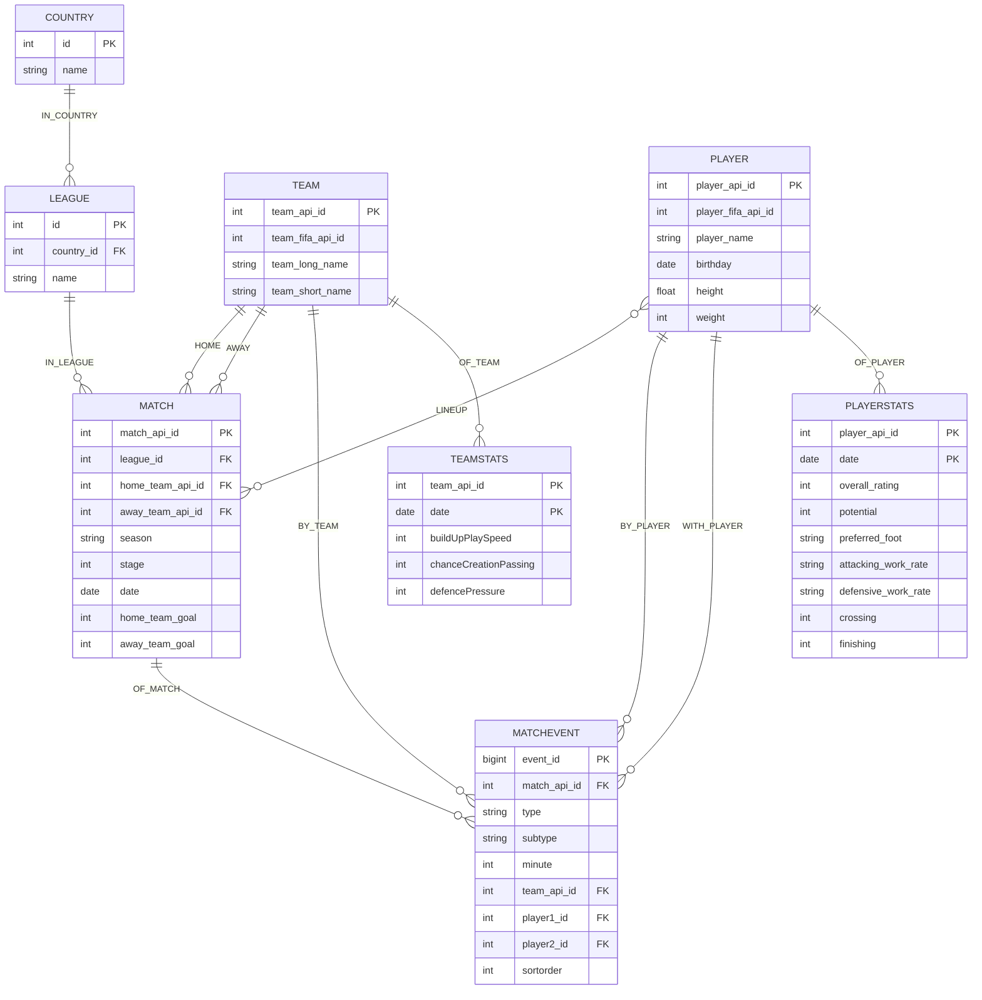

# Schema concettuale (ER)

Questo documento definisce il modello concettuale del dominio (European Soccer
Database) **indipendente dalla tecnologia di memorizzazione**. È la base
condivisa da cui derivano sia lo schema relazionale per PostgreSQL sia lo
schema a grafo per Neo4j.

## Entità

| Entità | Descrizione | Identificatore |
|---|---|---|
| **Country** | Nazione in cui si svolge un campionato | `country_id` |
| **League** | Campionato nazionale (es. Serie A, Premier League) | `league_id` |
| **Team** | Squadra di club | `team_api_id` |
| **Player** | Calciatore | `player_api_id` |
| **Match** | Singola partita di campionato | `match_api_id` |
| **MatchEvent** | Evento occorso durante una partita (gol, tiro, fallo, cartellino, cross, corner, possesso) | `event_id` (sintetico) |
| **PlayerStats** | Snapshot delle statistiche di un giocatore a una data | (`player_api_id`, `date`) |
| **TeamStats** | Snapshot delle statistiche di una squadra a una data | (`team_api_id`, `date`) |

## Relazioni

| Relazione | Cardinalità | Note |
|---|---|---|
| League **IN_COUNTRY** Country | N : 1 | una lega appartiene a un paese |
| Match **IN_LEAGUE** League | N : 1 | una partita appartiene a una sola lega |
| Match **HOME** Team | N : 1 | la squadra di casa |
| Match **AWAY** Team | N : 1 | la squadra in trasferta |
| Player **LINEUP** Match | N : N | giocatori in campo + ruolo, posizione X/Y, lato (home/away) |
| MatchEvent **OF_MATCH** Match | N : 1 | ogni evento appartiene a una sola partita |
| MatchEvent **BY_TEAM** Team | N : 1 | la squadra che ha generato l'evento |
| MatchEvent **BY_PLAYER** Player (player1) | N : 1 | giocatore principale dell'evento (es. marcatore) |
| MatchEvent **WITH_PLAYER** Player (player2) | N : 1 (opzionale) | giocatore secondario (es. assistman, fallo subito) |
| PlayerStats **OF_PLAYER** Player | N : 1 | snapshot temporale degli attributi |
| TeamStats **OF_TEAM** Team | N : 1 | snapshot temporale degli attributi |

## Diagramma ER (Mermaid)

## Ipotesi e scelte progettuali

1. **Match-Lineup è un'associazione N:N con attributi**: ogni partita ha 22
   giocatori in campo (11 home + 11 away) con attributi propri della
   partecipazione (lato, indice di posizione 1-11, coordinate X/Y).
   Questo "esplode" le 44 colonne `home_player_*`/`away_player_*` di Match.
2. **MatchEvent è un'entità derivata** dal parsing dei campi XML
   (`goal`, `shoton`, `shotoff`, `card`, `cross`, `corner`, `foulcommit`,
   `possession`) presenti nel sorgente SQLite. È disponibile per circa il 55%
   delle partite (top-5 leghe + parte di Eredivisie/Eredivisie). Le partite
   senza eventi continuano a esistere come `Match` ma senza `MatchEvent`.
3. **Quote scommesse escluse**: le 20 colonne di odds (B365H, BWH, IWH, ecc.)
   non rientrano nello scope del progetto e vengono ignorate.
4. **Statistiche giocatore/team versionate nel tempo**: `PlayerStats` e
   `TeamStats` sono entità deboli (la chiave include la data dello snapshot)
   per non perdere l'evoluzione temporale degli attributi.
